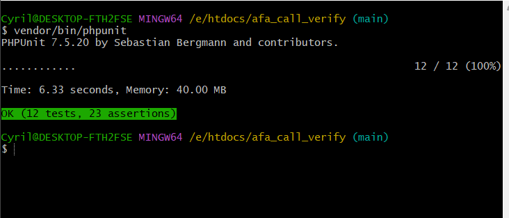
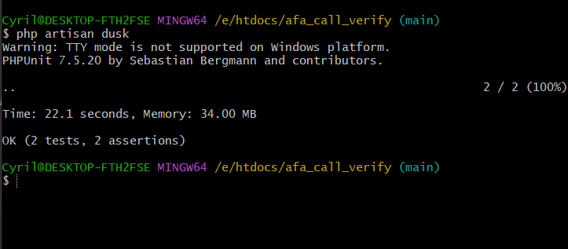

# Laravel GSM Call Web Project

## Table of Contents

- [Introduction](#introduction)
- [Features](#features)
- [Prerequisites](#prerequisites)
- [Installation](#installation)
- [Folder Structure](#folder-structure)
- [Technologies Used](#technologies-used)
- [Contributing](#contributing)
- [License](#license)
- [Contact](#contact)

## Introduction

This is a web application built with Laravel and Vue that allows registered users to trigger GSM calls from a web browser. The admin panel provides functionality to manage registered usersand view call logs.

## Features

- **User Registration**: Users can register and create accounts through the admin panel.
- **GSM Call Triggering**: Registered users can initiate GSM calls from their web browsers.
- **Call Logging**: All calls triggered by users are logged, recording important details such as time, duration, and the user who initiated the call.
- **Admin Panel**: The admin panel provides privileged access to administrators to manage users, view call logs, and generate reports.

- 
### Prerequisites

- PHP (>= 7.4.0)
- Composer (>= 2.0.0) installed on your system.
- Node.js
- NPM
- MySQL database

## Installation

- Clone this repository to your local machine:
  ```bash
     git clone https://github.com/cgardesey/afa_call_verify.git
- Navigate to the project directory:
   ```bash
      cd applications
- Create a .env file:
   ```bash
      cp .env.example .env
- Generate the application key:
   ```bash
      php artisan key:generate
- Setup and start mysql server and set up your database credentials in the .env file:
   ```bash
      DB_CONNECTION=mysql
      DB_HOST=127.0.0.1
      DB_PORT=3306
      DB_DATABASE=your_database_name
      DB_USERNAME=your_database_username
      DB_PASSWORD=your_database_password
- Install the dependencies:
   ```bash
      composer install
- Install JavaScript dependencies using npm:
   ```bash
      npm install  
- Run the database migrations and seed the database:
   ```bash
      php artisan migrate
- Compile the frontend assets:
   ```bash
      npm run dev
- Start the development server:
   ```bash
      php artisan serve --host=localhost --port=50003

- You should now be able to access the application at `http://localhost:50003`.


- Run all tests (unit and feature tests):

  ```bash
    # On Windows platform, run:
    vendor\bin\phpunit
  
    # On Unix-like platform, run:
    vendor/bin/phpunit 
All test should pass as shown:

  

- Follow [this guide](https://chromedriver.chromium.org/downloads/version-selection) to install a version of chrome driver compatible with your version of Chrome browser

- Run browser tests:

  ```bash
    php artisan dusk
All test should pass as shown:


  


## Folder Structure

The application follows a standard Laravel folder structure:

- `app`: Contains the core application logic.
- `config`: Contains configuration files.
- `database`: Contains database-related files such as migrations and seeders.
- `public`: Contains the public assets, including CSS, JavaScript, and media files.
- `resources`: Contains the views, language files, and frontend assets.
- `routes`: Contains the application routes.
- `storage`: Contains generated files like logs, uploaded files, etc.
- `tests`: Contains the test cases.


  ## Technologies Used

- PHP (>= 7.4)
- Composer (https://getcomposer.org/)
- Node.js (>= 14.x)
- npm (>= 6.x)
- Laravel 5.x (PHP framework)
- Vue.js 3.x (JavaScript framework)
- Bootsrap CSS (Utility-first CSS framework)
- MySQL (Database)
- Laravel Mix (Asset compilation)

## Contributing

I welcome contributions to enhance this project. If you find any bugs or have feature suggestions, please open an issue or submit a pull request. Make sure to follow the existing coding style and conventions.

## License

This project is open-source and available under the [MIT License](https://opensource.org/licenses/MIT).

## Contact

If you have any questions or need assistance, please contact me at cyrilgardesey@gmail.com.

Happy coding!

   

